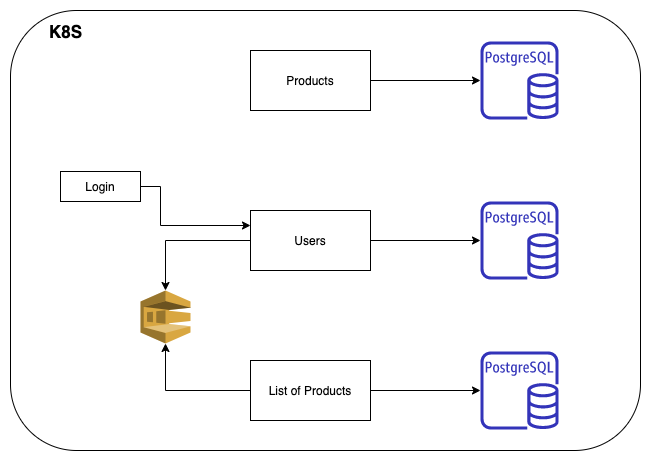

# POC Favorite Products List

A ideia foi desenvolver uma funcionalidade de Produtos favoritos dos clientes do site VendasOnline12345, em que as aplicações irão enviar requisições para um backend que irá gerenciar os clientes e seus produtos favoritos.

Para isso, foi pensada uma arquitetura de microservices, onde foram divididos em:
- Users;
- Products;
- List of Products.

Cada serviço dispõe uma série de endpoints e teve ter seu próprio banco de dados. (No código foi utilizado apenas uma instância com três tabelas para simplificar a POC. Mas caso esse serviço for deployado em produção, deve-se subir três bancos separados para cada microservice).

A tecnologia escolhida para o banco de dados foi um banco relacional Postgres, visto que é um banco amplamente utilizado para casos de usuários e autenticações, e em caso de altas volumetrias, é possível escalar réplicas para separar as operações de leitura e de escrita.

Além disso, foi utilizada um sistema de filas. No caso, foi pensado na Amazon SQS para esse propósito. 

Cada microservice deve ser deployado em seu próprio container, e para a orquestração dos mesmos foi pensado na utilização do Kubernetes. 

A arquitetura ficou da seguinte maneira:


## Microservice 1: User

No microservice de usuário é possível inserir, atualizar, obter e remover usuários. Além disso, dentro desse microservice é possível realizar o login do usuário. 

Para realizar a atualização e a remoção de um usuário, é necessário que o mesmo esteja logado, e que apenas possa realizar tais operações no seu usuário.

Já para inserir novos usuários, obter um determinado usuário ou obter todos os usuários da base, não é necessário o login.

A collection do Postman com as requisições estão em anexo.

Além disso, quando um novo usuário é inserido, uma nova mensagem é inserida na fila SQS com os dados desse consumidor.

## Microservice 2: Product

No microservice de produto é possível inserir, atualizar, obter e remover produtos. O desenho da API foi feito com o auxílio da documentação passada. 

A collection do Postman com as requisições também estão em anexo.

## Microservice 3: List of Products

Esse microservice se comunica de duas formas: lendo uma fila e dispondo APIs. 

Um dos requisitos do projeto é que o usuário tenha apenas uma lista de produtos favoritos. Então assim que um usuário é criado no microservice de user, uma mensagem e colocada na fila e o microservice de lista de produtos consome essa mensagem e cria a lista de produtos para esse usuário. 

Com isso, o serviço dispõe endpoints para consultas de lista por ID do consumidor, todas as listas existentes, inclusão de produtos na lista e exclusão de produtos na lista.

Um produto só pode ser adicionado na lista uma vez. Então no caso de já existência do produto, a inclusão será ignorada. 

Um produto só pode ser incluído na lista caso ele exista. Se ele não existir, não pode ser incluído na lista.

Os mesmos cenários valem para exclusão. 

A collection do Postman com as requisições também estão em anexo.

## Dependências

Para rodar o projeto é necessário ter instalado:
- Docker-compose
- Go
- aws cli

## Para rodar o projeto:

Na raíz do projeto, digite o comando:
- Docker-compose up —build

Que irá realizar a subida do Banco de Dados e do Localstack, estrutura utilizada para simular o ambiente AWS localmente. Na sequência, digite o seguinte comando para criar uma fila chamada user-list
- aws sqs --endpoint-url http://localhost:4566 create-queue --queue-name user-list

Em seguida, é necessário subir todos os serviços. Para isso, entre em cada diretório e rode o projeto:
- cd user/ && go run main.go
- cd products/ && go run main.go
- cd list-products/ && go run main.go

O serviço de produtos irá subir na porta 8000, o de usuários na 8001 e o serviço de lista na porta 8002.

## O que ficou faltando:

Testes. Como queria fazer o MVP e botar para funcionar, acabei deixando os testes de lado. Para esses serviços, utilizaria o conceito de testes unitários. 

Implementar a necessidade de login para manipular a lista de produtos. 

Subir Todos os serviços num cluster Kubernetes. 

Implementar um esboço de frontend para validar o funcionamento das APIs. Um esboço mesmo, porque sou um terror fazendo tela (rsrs). 

Deployar isso na AWS e configurar todos esses endpoints utilizando um API Gateway, assim a segurança ficaria muito mais reforçada.

